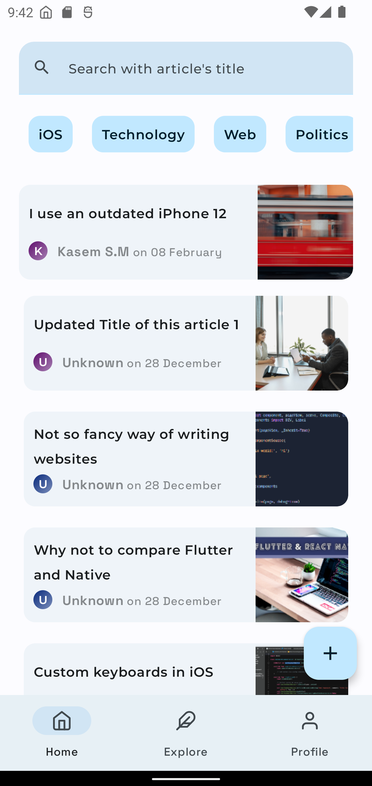
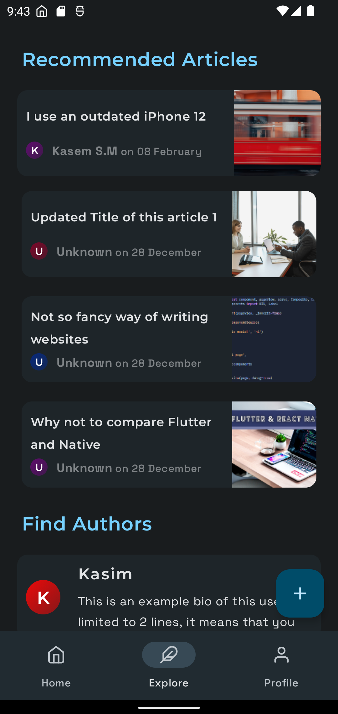
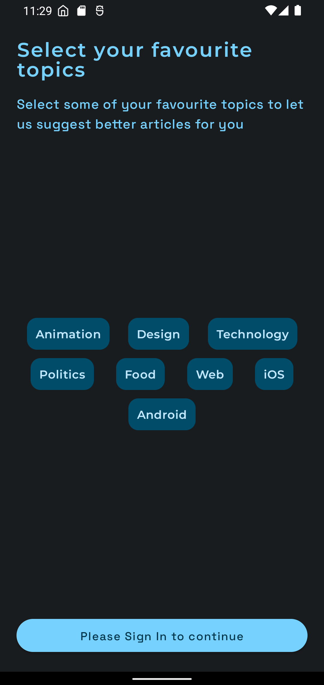
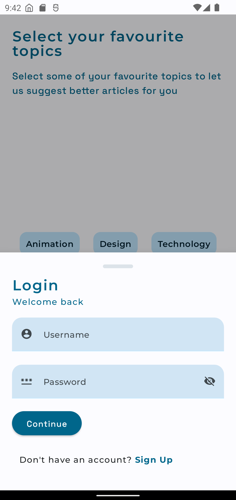
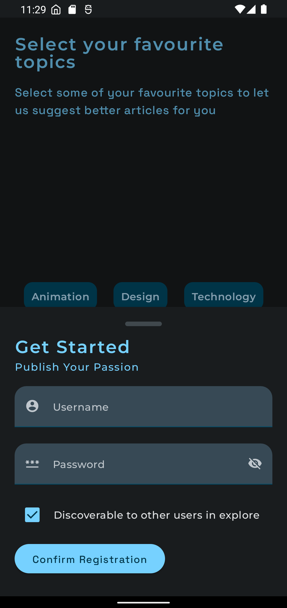

[](https://github.com/kasem-sm/SlimeKT/actions/workflows/android_action.yml)
[](https://github.com/kasem-sm/SlimeKT/actions/workflows/api_action.yml)


[](https://github.com/kasem-sm/SlimeKT/stargazers)
[](https://github.com/kasem-sm/SlimeKT/watchers)

## Introduction 🙋‍♂️

Article sharing platform where you can _**personalize, subscribe to your favourite topics, get
daily-read reminders, explore new authors and share your articles**_. It uses the most cutting edge
technology in the frontend and backend part such as <b>Ktor, MongoDB and Jetpack Compose.</b>

## Documentation 📚

[](https://kasem-sm.github.io/SlimeKT)

We have prepared a detailed guide on every feature, API routes, project structure and documentation
of each module, Please visit [here]() to know more about the same. Additionally every major folder such as [`/api`](/api)
and [`/features`](/features), contains short documentation in the Github repository itself.

## Repository overview 📂

SlimeKT has its own backend built with Ktor. The folder [`/api`](/api) consists of our
backend deployed on Heroku. SlimeKT Android application resides inside of the [`/app`](/app) folder.

## Sample, Screenshots and Demo 📱

[](https://github.com/kasem-sm/slimekt/releases/sample.apk)

<table>
    <tr>
        <td>
            <figure>
                <a href="#1">
                    
                </a>
                <figcaption>Home screen</figcaption>
            </figure>
        </td>
        <td>
            <figure>
                <a href="#2">
                    
                </a>
                <figcaption>Explore Screen</figcaption>
            </figure>
        </td>
        <td>
            <figure>
                <a href="#3">
                    
                </a>
                <figcaption>Detail Screen</figcaption>
            </figure>
        </td>
    </tr>
    <tr>
        <td>
            <figure>
                <a href="#4">
                    
                </a>
                <figcaption>Subscribe Topics Screen</figcaption>
            </figure>
        </td>
        <td>
            <figure>
                <a href="#5">
                    
                </a>
                <figcaption>Login sheet</figcaption>
            </figure>
        </td>
        <td>
            <figure>
                <a href="#6">
                    
                </a>
                <figcaption>Register sheet</figcaption>
            </figure>
        </td>
    </tr>    
</table>

For more screenshots and screen-recording demo, [please visit our documentation]().

## What's next ✨

SlimeKT is a _Work In Progress_ project and there are several features/ideas which are yet to be implemented. You can help us in our journey by contributing your skills. Please don't forget to create a issue/feature request first or pick any existing one.

## Tech stack / Miscellaneous Features 🚀
- Kotlin, Jetpack Compose, Coroutines, Flow, Accompanist, Navigation Component, Ktor (Android client), Room Database, Coil, Dagger Hilt, etc.
- **Observer Pattern:** Data from cache  would be shown while new data is fetched from the server. The data on the screen gets updated immediately once new data is cached.
- **WorkManager:** App uses WorkManager API to update user's subscriptions and to fetch Daily Read articles.
- **AndroidX Glance:** Used to make App's widget with the power of Jetpack Compose.
- **Material You:** The most exciting one.

Please visit [the documentation of this project]() for detailed information.

## Contributions and Contributors 👷‍♂️

There are no special rules for contributing your expertise and making the open source community more powerful. Just don't forget to file a issue or start a discussion so that I may not be surprised when you create a pull request. Running `spotlessApply` before creating a pull request would be _cherry on the cake_.

* Special thanks to our contributors:
  - The first one gets featured here 😎
  - [All contributors](https://github.com/kasem-sm/SlimeKT/graphs/contributors)

## Medium Articles related to this project 🖋

1. When Jetpack's Glance met his fellow worker, WorkManager (draft)
2. Create Animated PlaceHolder for your Jetpack Compose text fields (draft)
3. Android’s IME Actions: Don’t ignore them. [Read here](https://proandroiddev.com/androids-ime-actions-don-t-ignore-them-36554da892ac)

More articles by [_kasem-sm_](https://medium.com/@kasem.sm) on Medium.

## Contact 🤙

Direct Messages on [My Twitter](https://twitter.com/KasemSM_) are always open. If you have any questions related to SlimeKT or Android development, ping me anytime!

## Credits 💎

- [**Tivi**](https://github.com/chrisbanes/tivi) by [chrisbanes](https://github.com/chrisbanes) - A divine project for me to explore. I refer to this project as Gold 🥇.
- [**Gabor Varadi**](https://twitter.com/Zhuinden) - Always willing to answer my questions. A great man and blessing to the Android Community (AKA, the `SavedStateHandle` preacher).
- [**Doris Liu**](https://twitter.com/doris4lt) and [**Manuel Vivo**](https://twitter.com/manuelvicnt) - They always help reviewing my code snippets and add their value to it.

## License

```
Copyright 2022 Kasem SM

Licensed under the Apache License, Version 2.0 (the "License");
you may not use this file except in compliance with the License.
You may obtain a copy of the License at
    http://www.apache.org/licenses/LICENSE-2.0
    
Unless required by applicable law or agreed to in writing, software
distributed under the License is distributed on an "AS IS" BASIS,
WITHOUT WARRANTIES OR CONDITIONS OF ANY KIND, either express or implied.
See the License for the specific language governing permissions and
limitations under the License.
```
