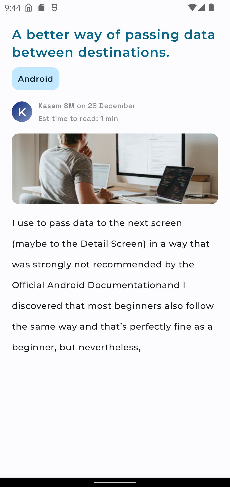

## Introduction

Robust Article sharing platform where you can personalize, subscribe to your favourite topics, get
daily-read reminder, explore new authors and share your articles. It uses the most cutting edge
technology in the frontend and backend part such as <b>Ktor, MongoDB and Jetpack Compose.</b>

## Documentation

We have prepared a detailed guide on every features, API routes, project structure and documentation
of each module. Please visit [here](). Additionally every major folder such as [`/api`](/api)
and [`/features`](/features), contains short documentation in Github repository itself.

## Repository overview

SlimeKT has it's own backend built with Ktor. The folder [`/api`](/api) consists of our
backend deployed on Heroku. SlimeKT Android application resides inside of [`/app`](/app) folder.

## Screenshots

<table>
    <tr>
        <td>
            <figure>
                <a href="#1">
                    
                </a>
                <figcaption>Home screen</figcaption>
            </figure>
        </td>
        <td>
            <figure>
                <a href="#2">
                    
                </a>
                <figcaption>Explore Screen (Dark)</figcaption>
            </figure>
        </td>
        <td>
            <figure>
                <a href="#3">
                    
                </a>
                <figcaption>Detail Screen</figcaption>
            </figure>
        </td>
    </tr>
    <tr>
        <td>
            <figure>
                <a href="#4">
                    
                </a>
                <figcaption>Subscribe Topics Screen</figcaption>
            </figure>
        </td>
        <td>
            <figure>
                <a href="#5">
                    
                </a>
                <figcaption>Login bottom sheet</figcaption>
            </figure>
        </td>
        <td>
            <figure>
                <a href="#6">
                    
                </a>
                <figcaption>Register bottom sheet</figcaption>
            </figure>
        </td>
    </tr>    
</table>

## Contribution

There is no special rules for contributing your expertise and making the open source community more powerful. Just don't forget to file a issue or start a discussion so that I may not be surprised when you create a pull request. Running `spotlessApply` before creating a Pull request would be <b><i>cherry on the cake</b></i>.

## Articles related to this project

1. When Jetpack's Glance met his fellow worker, WorkManager (unreleased)
2. Create Animated PlaceHolder for your Jetpack Compose text fields (unreleased)
3. Android’s IME Actions: Don’t ignore them. [Read here](https://proandroiddev.com/androids-ime-actions-don-t-ignore-them-36554da892ac)

More articles by [_kasem-sm_](https://medium.com/@kasem.sm) on Medium.

## Contact

My DMs on [Twitter](https://twitter.com/KasemSM_) are always open. If you have any questions related to SlimeKT or Android development, ping me anytime!

## Tech stack / Miscellaneous Features

- **Observer Pattern:** Data from cache  would be shown while new data is fetched from the server. The data on the screen gets updated immediately once new data is cached (Hot Flow).
- **WorkManager:** App uses WorkManager API to update user's subscription and to fetch Daily Read article.
- **AndroidX Glance:** Used to make App's widget with the power of Jetpack Compose.

Please visit [the documentation of this project]() for detailed information.

## Credits

- [**Tivi**](https://github.com/chrisbanes/tivi) by [chrisbanes](https://github.com/chrisbanes) - A divine project for me to explore. I refer to this project as `Gold`.
- [**Gabor Varadi**](https://twitter.com/Zhuinden) - Always willing to answer my dumb questions. A great man and blessing to the Android Community (AKA, the `SavedStateHandle` preacher).
- [**Doris Liu**](https://twitter.com/doris4lt) and [**Manuel Vivo**](https://twitter.com/manuelvicnt) - They always help reviewing my ugly code snippets and add their value to it.

## License

```
Copyright 2022 Kasem SM

Licensed under the Apache License, Version 2.0 (the "License");
you may not use this file except in compliance with the License.
You may obtain a copy of the License at
    http://www.apache.org/licenses/LICENSE-2.0
    
Unless required by applicable law or agreed to in writing, software
distributed under the License is distributed on an "AS IS" BASIS,
WITHOUT WARRANTIES OR CONDITIONS OF ANY KIND, either express or implied.
See the License for the specific language governing permissions and
limitations under the License.
```
