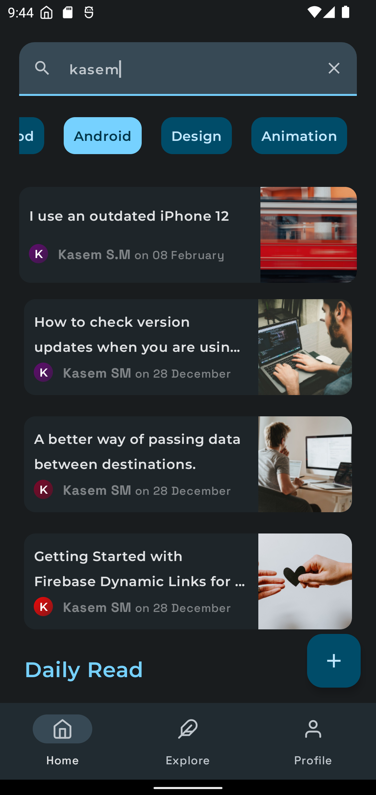
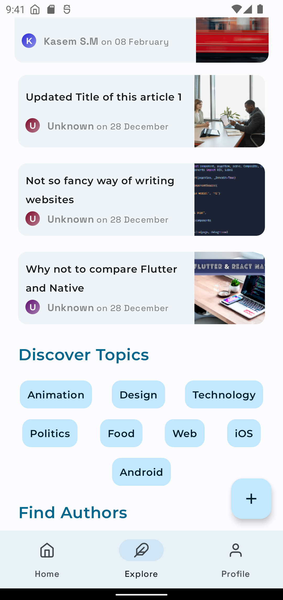
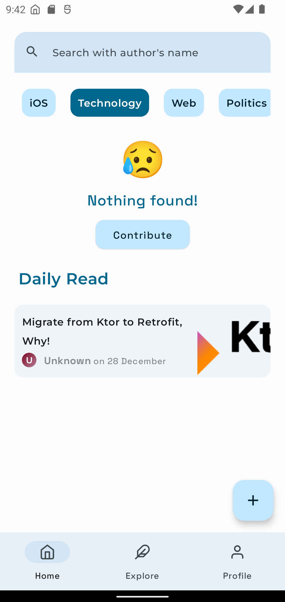
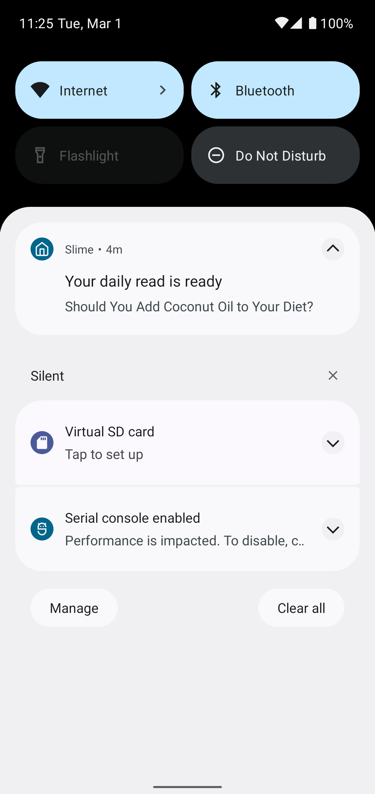
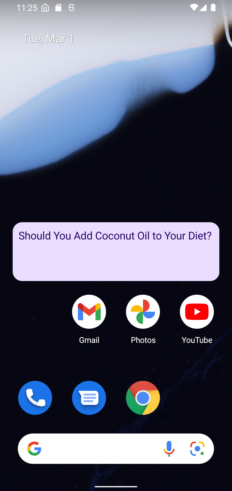

## Introduction

Robust Article sharing platform where you can personalize, subscribe to your favourite topics, get daily-read reminder, explore new authors and learn new things. It uses the most cutting edge techonology in the frontend and backend part such as <b>Ktor, MongoDB and Jetpack Compose.</b>

## Screenshots

<table>
    <tr>
        <td>
            <figure>
                
                <figcaption>Home screen with subscribed topics at top</figcaption>
            </figure>
        </td>
        <td>
            <figure>
                
                <figcaption>Home screen with search query and topic selected</figcaption>
            </figure>
        </td>
    </tr>
    <tr>
        <td>
            <figure>
                
                <figcaption>Explore Screen</figcaption>
            </figure>
        </td>
        <td>
            <figure>
                
                <figcaption>Explore Screen (Dark)</figcaption>
            </figure>
        </td>
    </tr>
    <tr>
        <td>
            <figure>
                
                <figcaption>Detail Screen</figcaption>
            </figure>
        </td>
        <td>
            <figure>
                
                <figcaption>Detail Screen (Dark)</figcaption>
            </figure>
        </td>
    </tr>
    <tr>
        <td>
            <figure>
                
                <figcaption>Empty Article View</figcaption>
            </figure>
        </td>
        <td>
            <figure>
                
                <figcaption>Subscribe To Topics Screen</figcaption>
            </figure>
        </td>
    </tr>
    <tr>
        <td>
            <figure>
                
                <figcaption>Login bottom sheet</figcaption>
            </figure>
        </td>
        <td>
            <figure>
                
                <figcaption>Register bottom sheet</figcaption>
            </figure>
        </td>
    </tr>    
    <tr>
        <td>
            <figure>
                
                <figcaption>Daily Read Notification</figcaption>
            </figure>
        </td>
        <td>
            <figure>
                
                <figcaption>Daily Read Widget (Material You)</figcaption>
            </figure>
        </td>
    </tr>
</table>