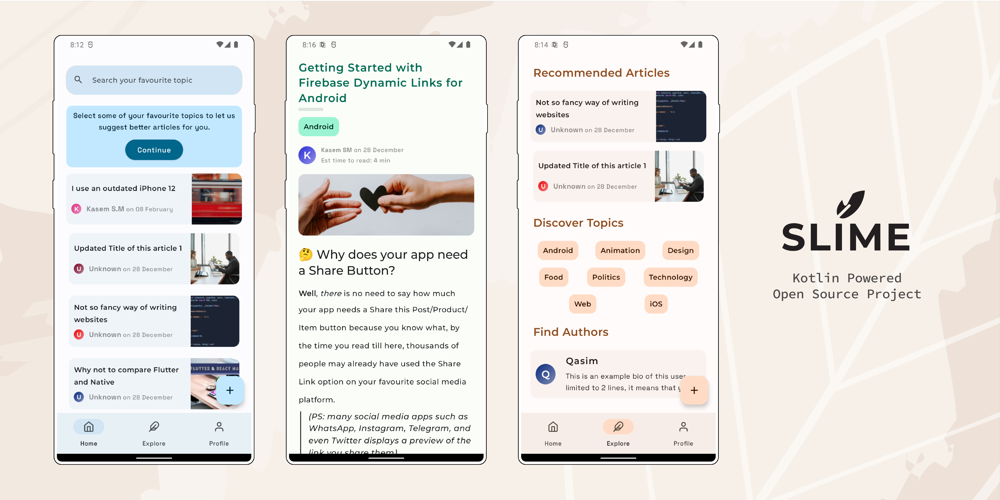

## Introduction 🙋‍♂️

Article sharing platform where you can _**personalize, subscribe to your favourite topics, get
daily-read reminders, explore new authors and share your articles**_. It uses the most cutting edge
technology in the frontend and backend part such as <b>Ktor, MongoDB and Jetpack Compose.</b>

It follows the recommended app architecture as stated in official [Android documentation](https://developer.android.com/jetpack/guide)

## Repository overview 📂

SlimeKT has its own backend built with Ktor. The folder [`/api`](https://github.com/kasem-sm/SlimeKT/tree/dev/api) consists of our
backend deployed on Heroku. SlimeKT Android application resides inside of the [`/app`](https://github.com/kasem-sm/SlimeKT/tree/dev/app) folder.

## Screenshots 📱

<table>
    <tr>
        <td>
            <figure>
                
                <figcaption>Home screen</figcaption>
            </figure>
        </td>
        <td>
            <figure>
                
                <figcaption>Explore Screen</figcaption>
            </figure>
        </td>
        <td>
            <figure>
                
                <figcaption>Detail Screen</figcaption>
            </figure>
        </td>
    </tr>
    <tr>
        <td>
            <figure>
                
                <figcaption>Subscribe Topics Screen</figcaption>
            </figure>
        </td>
        <td>
            <figure>
                
                <figcaption>Login sheet</figcaption>
            </figure>
        </td>
        <td>
            <figure>
                
                <figcaption>Register sheet</figcaption>
            </figure>
        </td>
    </tr>    
    <tr>
        <td>
            <figure>
                
                <figcaption>Subscribe Topics Screen</figcaption>
            </figure>
        </td>
        <td>
            <figure>
                
                <figcaption>Login sheet</figcaption>
            </figure>
        </td>
    </tr>    
</table>

## Medium Articles 🖋

1. When Jetpack's Glance met his fellow worker, WorkManager (draft)
2. Create Animated PlaceHolder for your Jetpack Compose text fields (draft)
3. Android’s IME Actions: Don’t ignore them. [Read here](https://proandroiddev.com/androids-ime-actions-don-t-ignore-them-36554da892ac)

More articles by [_kasem-sm_](https://medium.com/@kasem.sm) on Medium.

## Contact 🤙

Direct Messages on [My Twitter](https://twitter.com/KasemSM_) are always open. If you have any questions related to SlimeKT or Android development, ping me anytime!

## Credits 💎

- [**Tivi**](https://github.com/chrisbanes/tivi) by [chrisbanes](https://github.com/chrisbanes) - A divine project for me to explore. I refer to this project as Gold 🥇.
- [**Gabor Varadi**](https://twitter.com/Zhuinden) - He is always willing to answer my questions. A great man and a blessing to the Android community (AKA, the `SavedStateHandle` preacher).
- [**Doris Liu**](https://twitter.com/doris4lt) and [**Manuel Vivo**](https://twitter.com/manuelvicnt) - They always help review my code snippets and add their value to them.
